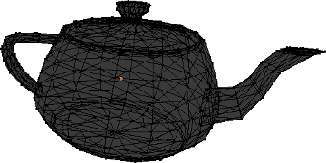
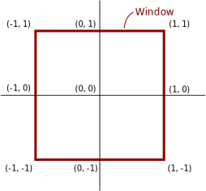
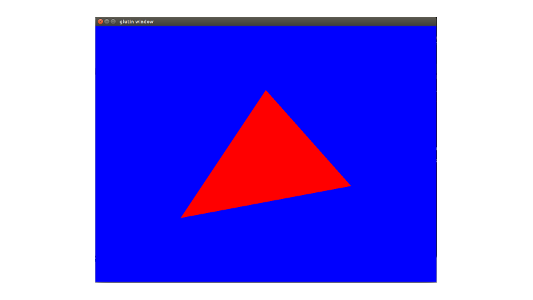

# 画一个三角形

OpenGL 并不提供可以直接绘制图形的函数, 例如: `draw_rectangle`, `draw_cube`, `draw_text`等等. 任何图形都是通过同样的方法进行处理: 通过图形管线(graphics pipeline). 对于 OpenGL 来说, 无论是绘制一个三角形还是一个有成千上万个多边形组成的 3D 模型还是高级阴影技术, 它们所使用的方法都是一致的.

这正是 OpenGL 的难点之一, 即使你只想画一个三角形, 你也必须学习图形管线相关的知识. 然而, 一旦你真正理解了这一步, 之后其余部分你便能游刃有余.

在我们开始绘制三角形之前, 我们需要在初始化阶段准备两样东西:

- 一个形状(Shape), 用来描述我们的三角形是什么样的.
- 一个能被 GPU 执行的程序(着色器程序).

## 形状

形状指的是一个物体的几何形状(geometry). 当你听到 "几何形状(geometry)" 这个词时, 你也许会想起正方形, 圆形等等, 但是在图形程序中, 我们唯一会使用的形状只有三角形(注意: 细分曲面技术(tessellation)可能会用到其他多边形, 但这和本文无关).

以下是一个物体的形状的例子. 如你所见, 它由成百上千个三角形, 并且只由三角形组成.



每个三角形由 3 个顶点构成, 这意味着所谓的形状只是由一组顶点连接在一起形成的三角形所组成的. 在 glium 中, 描述形状的第一步是创建一个名为 `Vertex`(名字不重要) 的结构体, 用来描述单个顶点. 之后我们可以创建一个 `Vec<Vertex>` 来表示顶点的集合.

```rust
#[derive(Copy, Clone)]
struct Vertex {
    position: [f32; 2],
}

implement_vertex!(Vertex, position);
```

在结构体 `Vertex` 中, 我们使用 `position` 属性来储存该顶点在窗口中的位置. 作为一个矢量渲染器, OpenGL 采用的坐标系并不使用像素作为坐标系的单位, 而是将窗口的宽度和高度分别看作两个单位长, 并将窗口的中心点视为坐标系的坐标原点.



当我们将坐标传递给 OpenGL 时, 我们需要使用这一套坐标系统. 接下来为我们的三角形选个形状吧, 例如:


然后转换成代码:

```rust
let vertex1 = Vertex { position: [-0.5, -0.5] };
let vertex2 = Vertex { position: [ 0.0,  0.5] };
let vertex3 = Vertex { position: [ 0.5, -0.25] };
let shape = vec![vertex1, vertex2, vertex3];
```

现在弄好三角形的形状了, 最后一步就是把三角形的形状数据传递给显卡的内存(也称为 _vertex buffer_ 顶点缓冲), 让显卡能够更快速地使用这些数据. 它能让我们的绘制操作变得更快, 尽管 OpenGL 并没有严格要求你这样做.

```rust
let vertex_buffer = glium::VertexBuffer::new(&display, &shape).unwrap();
```

某些更复杂的形状包含有数百或数千个顶点. 我们不仅仅需要提供用以储存顶点的列表, 同时需要告诉 OpenGL 如何将这些顶点连接成形(也就是顶点的索引). 因为我们现在只想画一个三角形, 所以这点其实和我们没多大关系, 我们只需传递给 glium 一个假的记号就行了.

```rust
let indices = glium::index::NoIndices(glium::index::PrimitiveType::TrianglesList);
```

## 程序

在上个世纪 90 年代的时候, OpenGL 刚被创造出来, 那时绘制一个物体只需发送一个形状以及各种参数例如颜色, 光线方向, 雾距离等等. 但是很快, 这些参数对游戏开发人员来说就不够用了. 当 OpenGL2 发布的时候, 一个更灵活的系统被加入了 OpenGL 中, 这就是 _shaders_(着色器). 几年后当 OpenGL3 发布时, 所有其他的参数都被移除掉了, 只剩着色器.

为了绘制三角形, 你需要了解一些有关绘制进程(也被称为管线)的基础知识.


最左边的坐标列表表示我们之前创建的形状的顶点. 当我们要求 GPU 绘制这个形状的时候, 首先对每个顶点执行一个叫做 _vertex shader_(顶点着色器) 的程序(在本例中执行了三次顶点着色器). 顶点着色器通知 GPU 每个顶点在屏幕上的坐标是多少. 之后 GPU 构建好我们的三角形, 并确认屏幕上哪些像素是位于该三角形内的. 然后, 它将对三角形内的每个像素执行一次 _fragment shader_(片段着色器). 片段着色器通知 GPU 每个像素的颜色是什么.

麻烦的是, 我们需要自己写顶点着色器和片段着色器的代码. 着色器代码所使用的是一种名为 _GLSL_ 的编程语言, 它和 C 语言很像.  
现在还没必要学 GLSL, 你只需要使用如下提供的源码就行了. 以下是顶点着色器的源码:

```rust
let vertex_shader_src = r#"
    #version 140

    in vec2 position;

    void main() {
        gl_Position = vec4(position, 0.0, 1.0);
    }
"#;
```

首先, `#version 140` 这一行告诉 OpenGL 该源码所对应的 GLSL 的版本. 某些硬件可能不支持最新的 GLSL, 所以我们尽可能使用早期的版本.

之前我们为我们的形状定义好 `Vertex` 结构体, 并用 `position` 属性来保存顶点的坐标. 但是和之前说的不同的是, 该结构体并不包含实际的顶点坐标, 仅仅只是一个传递给顶点着色器的属性. OpenGL 并不关心该属性的名字, 它所做的只是把属性的值传递给顶点着色器.  
`in vec2 position;` 这一行就是说, 顶点着色器希望接收一个名为 `position` 的属性, 属性的类型为 `vec2` (在 Rust 代码中对应的是 `[f32; 2]`).

着色器的 `main` 函数对每个顶点都调用了一次, 这意味着对我们的三角形来说有三次. 第一次调用, `position` 的值是 `[-0.5, -0.5]` , 第二次是 `[0, 0.5]`, 第三次是 `[0.5, -0.25]` . 实际上, 就是在 `main` 函数中, 我们通过 `gl_Position = vec4(position, 0.0, 1.0);` 来告诉 OpenGL 三角形各个顶点的坐标是多少. 因为 OpenGL 所需的值是 4 个元素的列表, 而我们传递的坐标只有两个元素, 因此需要对坐标进行一些变换(原因在之后的指南中会说明).

第二个着色器被称为片段着色器(有时被称为像素着色器).

```rust
let fragment_shader_src = r#"
    #version 140

    out vec4 color;

    void main() {
        color = vec4(1.0, 0.0, 0.0, 1.0);
    }
"#;
```

源代码和顶点着色器的很像, 不过这次 `main` 函数需要对每个像素都执行一次并返回该像素的颜色. 我们通过 `color = vec4(1.0, 0.0, 0.0, 1.0);` 这一行来实现. 就像之前 `clear_color` 函数一样, 我们需要将红, 绿, 蓝和 alpha 值这四个参数传递给每个像素. 这里我们的返回值是不透明的蓝色. 虽然可以根据像素来返回不同的颜色, 不过这要到下回再讨论.

现在我们已经写好着色器的代码了, 把它们发送给 glium 吧:

```rust
let program = glium::Program::from_source(&display, vertex_shader_src, fragment_shader_src, None).unwrap();
```

## 绘制

我们已经准备好了三角形的形状和着色器程序, 可以开始画三角形了!

还记得 `target` 对象吗? 我们将使用它来开始绘制操作.

```rust
let mut target = display.draw();
target.clear_color(0.0, 0.0, 1.0, 1.0);
// 在这里画三角形
target.finish().unwrap();
```

绘制操作需要以下几件东西: 顶点的源(这里我们使用 `vertex_buffer` ), 索引的源(我们使用 `indices` 参数), 一个着色器程序, 着色器程序使用的 uniform 变量, 以及一些绘制参数(draw parameters). 我们将在下一节解释 uniform 变量和绘制参数, 现在我们使用默认值就好.

```rust
target.draw(&vertex_buffer, &indices, &program, &glium::uniforms::EmptyUniforms,
            &Default::default()).unwrap();
```

"绘制" 这一词可能会让你认为绘制是一项需要大量时间的繁重操作. 然而实际上, 画一个三角形只需要不到几微秒的时间. 如果一切顺利, 你应该能看到一个还过得去的小三角形:



**[完整的源码在此](https://github.com/glium/glium/blob/master/examples/tutorial-02.rs).**

> 原地址: <https://github.com/glium/glium/blob/master/book/tuto-02-triangle.md>
