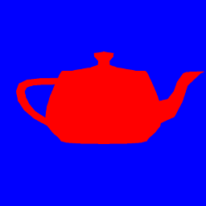

# 更复杂的图形

之前我们绘制了一个简单的三角形, 现在我们打算绘制一个更复杂的形状: 茶壶.  
犹他茶壶是一个十分著名的 3D 模型, 人们将其视为计算机图形学的 "hello world".

在实际应用中, 复杂的模型("复杂" 在这里是和几个顶点构成的 "简单" 图形相对的概念)通常在运行时从文件中加载. 本指南已经将模型解码并放入 Rust 代码中, 我们可以直接使用现成的 Rust 代码文件.  
[**代码在这**](https://github.com/glium/glium/blob/master/book/tuto-07-teapot.rs).

[**或者这里**](/Source/Tuto-7-Shape/tuto-07-teapot.rs)

该 .rs 文件提供 3 个数组:

- 顶点位置的数组(`VERTICES`).
- 包含有每个顶点的法线的数组(`NORMALS`). 顶点的法线垂直于物体在该顶点处的切面. 我们现在加载这个数组, 但是在之后的指南中才会用到它.
- 顶点绘制索引的数组(`INDICES`).

计算机图形学中所有的形状都是由三角形构成的. 在实际的 3D 模型中, 这些三角形中有些顶点是重合的, 因此为了避免重复绘制顶点, 我们将储存三角形的列表和储存顶点的列表分开.

实际上, `INDICES` 中元素是 `VERTICES` 和 `NORMALS` 数组的索引, 每 3 个索引(indices)一组构成一个三角形. 例如 `INDICES` 的前三个元素是 7, 6, 1. 那么其组成的三角形将包含顶点 7, 6, 1, 而这三个顶点的数据分别位于 `VERTICES` 和 `NORMALS` 的第 7, 6, 1 位(从 0 开始).

## 加载形状

现在我们将包含有模型的 Rust 文件当成名为 `teapot` 的模块来使用.

```rust
mod teapot;
```

直接加载其中的数据:

```rust
let positions = glium::VertexBuffer::new(&display, &teapot::VERTICES).unwrap();
let normals = glium::VertexBuffer::new(&display, &teapot::NORMALS).unwrap();
let indices = glium::IndexBuffer::new(&display, glium::index::PrimitiveType::TrianglesList,
                                      &teapot::INDICES).unwrap();
```

我们在这里使用了一个新类型: `IndexBuffer`. 正如它的名字, 它是一种用于存储顶点索引的缓冲.

在我们创建 `IndexBuffer` 时, 我们需要指定缓冲区内的图元类型, 在这里我们指定其为三角形列表.  
有多种图元类型可供选择, 不过三角形列表是最常用的.

## 着色器程序

我们需要修改一下顶点着色器的代码.

现在, 我们打算获取两个属性: `position` 和 `normal`.  
同时, `position` 的类型也变成了 `vec3`.

```glsl
#version 140

in vec3 position;
in vec3 normal;

uniform mat4 matrix;

void main() {
    gl_Position = matrix * vec4(position, 1.0);
}
```

我们赋给 `gl_Position` 属性的值是该顶点在窗口的坐标系中的位置坐标. 为什么它会由 4 部分组成? 这是因为:

- 窗口坐标系空间实际上是 3D 的, OpenGL 将我们的屏幕视为 3 维的.
- 顶点着色器在执行之后, 前三个坐标立即除以第四个坐标, 然后舍弃掉第四个坐标.

例如: 当我们输出 `gl_Position = vec4(2.0, -4.0, 6.0, 2.0);` 时, GPU 会将前三个参数除以 `2.0` , 就能获得其在屏幕上的坐标 `(1.0, -2.0, 3.0)` .

前两个坐标(`1.0` 和 `-2.0`)是顶点在屏幕上的位置, 第三个坐标(`3.0`)是该顶点的深度. 深度值现在暂时先忽略, 我们将在之后的指南中使用.

在片段着色器中, 我们暂时先将输出颜色设为红色:

```glsl
#version 140

out vec4 color;

void main() {
    color = vec4(1.0, 0.0, 0.0, 1.0);
}
```

## 绘制

和之前的章节相比, 本节的绘制部分有两处不一样的地方:

- 我们有两个顶点缓冲. 我们将通过传递一个包含这两个缓冲的元组来解决这个问题. `draw` 函数的第一个参数必须实现 trait `MultiVerticesSource` , 而单个缓冲或者由缓冲构成的元组都实现了该 trait .
- 我们又有索引对象, 因此我们将对索引缓冲的引用传递给 `draw` 函数.

```rust
let matrix = [
    [1.0, 0.0, 0.0, 0.0],
    [0.0, 1.0, 0.0, 0.0],
    [0.0, 0.0, 1.0, 0.0],
    [0.0, 0.0, 0.0, 1.0f32]
];

target.draw((&positions, &normals), &indices, &program, &uniform! { matrix: matrix },
            &Default::default()).unwrap();
```

如果你执行上面的代码, 你将会发现...


...等等, 有些不对!

在计算机图形学中, 上图显示的问题十分常见, 在这种情况下, 你不一定知道为什么会这样. 试着猜猜问题出在哪儿!

答案是: 模型太大了, 直接填满了整个屏幕. 模型的坐标范围大概在 `-100` 到 `+100` 之间, 但是我们的屏幕的坐标范围在 `-1.0` 到 `1.0` 之间.  
现在, 我们需要调整 matrix 来将模型的尺寸缩小到原来的 1/100:

```rust
let matrix = [
    [0.01, 0.0, 0.0, 0.0],
    [0.0, 0.01, 0.0, 0.0],
    [0.0, 0.0, 0.01, 0.0],
    [0.0, 0.0, 0.0, 1.0f32]
];
```

现在你将看到正确的结果:



看起来很简陋, 不过这是我们在 3D 渲染方面迈出的第一步.

**[完整的源码在此](https://github.com/glium/glium/blob/master/examples/tutorial-07.rs).**

> 原地址: <https://github.com/glium/glium/blob/master/book/tuto-07-shape.md>
