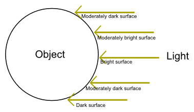
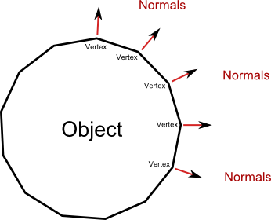
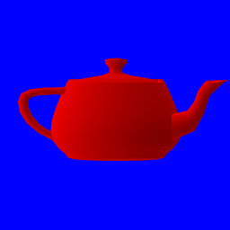

原地址: <https://github.com/glium/glium/blob/master/book/tuto-08-gouraud.md>

# 高洛德着色渲染法(Gouraud shading)

让我们继续绘制茶壶:  


显然, 这幅画有些不对: 除了茶壶的边缘外, 我们并没有在茶壶上看到任何弧度.  
这倒不是因为茶壶是红色, 而是因为没有光照(Lighting).  

光照是一个十分复杂的主题, 现在已经有许多不同的技术来实现光照. 作为光照学习的第一步, 本节我们将使用一种名为 *高洛德着色渲染法(Gouraud shading)* 的简便方法来.    

## 理论

高洛德着色渲染法的思想是, 假如光的方向与物体表面垂直, 那么这块区域应当是明亮的. 如果光的方向与物体表面平行, 那么这块区域应当是暗的. 



我们打算在片段着色器中对每个片段都进行一次这样的计算. 每个像素的亮度应该等于 `sin(angle(surface, light))` . 如果光线和物体表面垂直, 那么二者的角度为 `pi/2`, 而亮度为 `1`, 如果光线和物体表面平行, 那么角度为 `0` 而亮度也为 `0`. 

问题是: 我们怎么知道物体表面和光线的夹角? 还记得上一节的法线(normals)吗, 到了它出场的时候了.  

正如上一节提到的, 某个给定顶点的法线向量垂直于该点的切面. 而某个顶点的法线只有在知道其周围顶点的情况下才能计算得出, 因此在3D建模软件中导出模型时, 通常会计算每个顶点的法线.  



因为法线方向和物体表面垂直, 我们只需调整之前的计算式. 如果光线和法线平行, 那么物体表面应该是明亮的, 如果光线垂直于法线, 那么表面应该是暗的. 于是, 公式如下:  
`brightness = cos(angle(normal, light));`  

## 实践

计算的主力部分将在片段着色器中完成. 然而, 我们要先修改顶点着色器的代码, 以将法线数据传递给片段着色器. 为此, 我们需要指定更新的GLSL版本, 因为v140版本不支持我们接下来要用到的函数. 为了让顶点着色器能完成下面的工作, 我们的GLSL的版本至少应该是v150.  

```glsl
#version 150      // 更新版本

in vec3 position;
in vec3 normal;

out vec3 v_normal;      // 新增

uniform mat4 matrix;

void main() {
    v_normal = transpose(inverse(mat3(matrix))) * normal;       // 新增
    gl_Position = matrix * vec4(position, 1.0);
}
```

我们还需要用matrix来乘法线, 不过和之前相比, 变换有些不同, 计算也有点奇怪. 因为本指南没有解释矩阵的工作原理, 因此也不会解释为什么你必须要用matrix的逆矩阵的转置来乘.   

如果你回顾第五节, 你会发现, 从顶点着色器传递给片段着色器的属性在每个片段上都被插值了. 这也意味着每个片段都能获取不同于其邻近片段的法线值, 因此最终的颜色也会不同.  

现在看看片段着色器:  

```glsl
#version 140

in vec3 v_normal;
out vec4 color;
uniform vec3 u_light;

void main() {
    float brightness = dot(normalize(v_normal), normalize(u_light));
    vec3 dark_color = vec3(0.6, 0.0, 0.0);
    vec3 regular_color = vec3(1.0, 0.0, 0.0);
    color = vec4(mix(dark_color, regular_color, brightness), 1.0);
}
```

为了计算每个片段的亮度, 我们首先将 `v_normal` 和 `u_light` 规范化, 然后计算二者的[点积](https://en.wikipedia.org/wiki/Dot_product). 这个方法十分有效, 因为它将直接返回这两个向量之间夹角的 cos 值, 而且只需要进行三次乘和三次加操作.  

接下来我们声明两种颜色: 一种是当表面完全处于暗处时的颜色, 一种是表面完全处于光亮处的颜色. 在现实生活中, 物体颜色为黑色并不是因为其没有直接暴露在光线下. 而且即使没有被光线直接照射的表面也会从其他间接光源处接收到光线. 因此我们将暗部的颜色设置为中等的红色.    

`mix` 函数将会按照亮度(brightness)的值在暗部颜色(dark_color)和明亮的颜色(regular_color)之间插值.  

别忘了在绘制时传递新建的 `u_light` uniform变量:  

```rust
// 光线的方向
let light = [-1.0, 0.4, 0.9f32];

target.draw((&positions, &normals), &indices, &program,
            &uniform! { matrix: matrix, u_light: light },
            &Default::default()).unwrap();
```

结果如下图所示:  



现在, 我们的模型有了光泽. 然而, 我们可以看到, 最后的渲染还是存在许多问题. 这些我们之后再说.  

**[完整的源码在此](https://github.com/glium/glium/blob/master/examples/tutorial-08.rs).**
