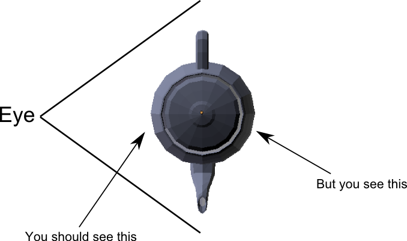
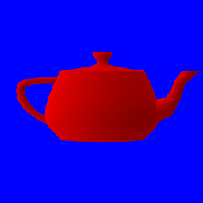
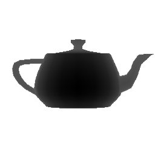

原地址: <https://github.com/glium/glium/blob/master/book/tuto-09-depth.md>

# 深度(depth)测试

我们上一节绘制的茶壶有那些问题呢?  


问题在于, 位于模型背面的面会显示在茶壶模型面朝你的这一面之上.  



看起来好蠢, 因为GPU只是计算工具而已, 它只会做你让它做的事.  

准确地说, 所有三角形都是按照指定的顺序依次绘制的, 后绘制的三角形会覆盖掉先绘制的三角形.  

## 使用深度值(depth)

两节之前, 我们了解了 `gl_Position` 的含义. 当时我们提到第三个参数的值是该顶点在屏幕上的深度(depth). 这个值越大, 该顶点离屏幕越远.  

目前, 这个值被GPU忽略了, 现在我们将用这个值来判断哪些像素是可见的.  

我们要在渲染管线中增加一个步骤. 在片段着色器被调用之后, GPU将该片段的深度值(通过从周围顶点的深度值插值来获取)和已经绘制到屏幕上同一位置的像素的深度值进行对比. 如果深度值低于现有的值, 像素将被绘制到屏幕上同时更新深度值. 如果高于现有的值, 这个像素将被丢弃.  

幸亏有这个办法, 当多个像素重叠到一起时, GPU只会绘制深度值最小的像素. 这也意味着, 你可以绘制多个物体(例如, 好几个茶壶), 而不用关心绘制它们的顺序.  

## 代码

我们要改3处地方:  

 - 在初始化阶段, 我们要求 glutin 创建一个储存所有像素的深度值的深度缓冲(depth buffer).  
 - 在每一帧之前, 将深度缓冲的内容重置为 `1.0` (深度的最大值). 和我们在之前章节将颜色重置为蓝色类似.  
 - 在绘制时传递额外的参数来要求GPU进行深度测试(depth test).  

第一步, 修改上下文(context)的构建代码:   

```rust
let context = glutin::ContextBuilder::new().with_depth_buffer(24);
```

我们要求系统分配一块24位的深度缓冲(a 24 bits depth buffer). 24位是一个十分常用的值. 深度测试对任何渲染系统来说都是很关键的功能, 因此深度缓冲应该设置成更通用的类型, 让你的程序在各种环境下都运行.  

第二步, 我们需要修改这一行:  

```rust
target.clear_color(0.0, 0.0, 1.0, 1.0);
```

改成这样:  

```rust
target.clear_color_and_depth((0.0, 0.0, 1.0, 1.0), 1.0);
```

该代码要求后端用 `1.0` 来填充深度缓冲. 注意这是一个 *逻辑上的(logical)* 值, 其可用范围为 `0.0` ~ `1.0`. 缓冲区内的实际内容是最大可表示数. 在24位的深度缓冲中, 为 `16777215`.  

第三步是在绘制的时候额外传递一个参数. 深度测试和深度缓冲的处理是直接由硬件完成的, 而不是由我们的着色器. 因此我们需要通知后端它可能要做的操作.  

```rust
let params = glium::DrawParameters {
    depth: glium::Depth {
        test: glium::draw_parameters::DepthTest::IfLess,
        write: true,
        .. Default::default()
    },
    .. Default::default()
};

target.draw((&positions, &normals), &indices, &program,
            &uniform! { matrix: matrix, u_light: light }, &params).unwrap();
```

`test` 参数指示只有在像素的深度值低于深度缓冲中已经存在的深度值时, 才保留该像素. `write` 参数指示如果像素的深度值通过了测试, 那么其深度值应该被写入深度缓冲中. 如果我们不把 `write` 设置为 `true`, 那么深度缓冲中的值将一直不变, 始终为 `1.0`.  

`Depth` 结构体还有另外两个成员, 我们这里不作讨论. 另外, `DrawParameters` 结构体也有很多用来描述渲染过程各个部分的成员. 未来, 这个结构体将会经常被用到.  

结果如下:  



如果你有在用OpenGL的调试器. 你就能看到深度缓冲的内容, 其中的值是用灰色的阴影表示的. 以下就是在绘制茶壶之后我们的深度缓冲中的内容:  



**[完整的代码在此](https://github.com/glium/glium/blob/master/examples/tutorial-09.rs).**
