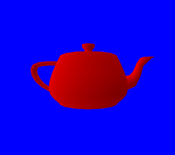

# 透视

在绘制茶壶时, 我们传递给着色器的矩阵中包含有茶壶模型的位置, 角度和大小等信息. 例如: 第三行第四列的元素就是物体的 z 坐标. 如果我们把它改成 `0.5`, 物体的 z 轴坐标就会增加 `0.5`.

```rust
let matrix = [
    [0.01, 0.0, 0.0, 0.0],
    [0.0, 0.01, 0.0, 0.0],
    [0.0, 0.0, 0.01, 0.0],
    [0.0, 0.0, 0.5, 1.0f32]
];
```

_注意: 这里修改的确实是第三行第四列的元素. 因为矩阵是按列主序(column-major)来储存元素的, 这意味着我们先储存第一列, 再储存第二列, 然后第三列, 然后第四列._

...没有任何变化, 我们的模型依然在原来的位置, 看上去上面的修改似乎没用. 不过, 如果你修改的是 x 或者 y 坐标, 你就会发现修改这个矩阵确实可以改变模型的位置.

而修改物体深度值没有任何反应的原因在于, 我们的场景没有任何透视(perspective)! 在之前的章节里, 深度值只在深度缓冲及进行深度测试时才有使用. 而在现实生活中, 物体离我们的眼睛越远, 它看上去就越小.

## 矫正透视

为了让物体符合透视规律的解决方法很简单: 将 x 坐标和 y 坐标值除以 z 坐标值(乘以某个系数之后的值). 因为坐标点 `(0, 0)` 是屏幕的中心, 因此越远处的物体看上去就越靠近屏幕的中心, 这就是[灭点](https://en.wikipedia.org/wiki/Vanishing_point).

不过, 想用简单的矩阵乘法来将 x 和 y 除以 z 是不可能的. 这就到了 `gl_Position` 的第四个坐标表演的时候了! 我们将系数存到 `w` 坐标中. 在顶点着色器执行之后, 将前三个坐标除以 `w` .

虽然看上去很让人费解, 不过别担心. 你只需记住, `gl_Position` 的第四个坐标就是专门用来矫正透视的.

## 宽高比

也许你已经发现了另一个问题, 我们的茶壶模型将会被拉伸, 以填满整个窗口. 这很正常, 因为坐标值 `-1` 到 `1` 指的是窗口的边.

然而在真正的游戏中场景并不会拉伸. 而且, 如果你调整窗口的大小, 你将发现场景会随着窗口的大小变化而变化.

为了解决这个问题, 我们需要用窗口的高度(height)/宽度(width)的比值来乘物体 x 坐标.

这样将压缩场景中的物体. 如果它们为了匹配窗口的尺寸而被拉伸, 其形状不会改变.

## 透视矩阵简介

我们之所以在同一节指南里介绍这两个问题, 是因为图形引擎通常使用同一个矩阵来解决它们: **透视矩阵(perspective matrix)**.

```rust
let perspective = {
    let (width, height) = target.get_dimensions();
    let aspect_ratio = height as f32 / width as f32;

    let fov: f32 = 3.141592 / 3.0;
    let zfar = 1024.0;
    let znear = 0.1;

    let f = 1.0 / (fov / 2.0).tan();

    [
        [f *   aspect_ratio   ,    0.0,              0.0              ,   0.0],
        [         0.0         ,     f ,              0.0              ,   0.0],
        [         0.0         ,    0.0,  (zfar+znear)/(zfar-znear)    ,   1.0],
        [         0.0         ,    0.0, -(2.0*zfar*znear)/(zfar-znear),   0.0],
    ]
};
```

_注意: 有两种惯用的坐标系: 左手坐标系(left-handed)和右手坐标系(right-handed). 本指南使用左手坐标系, 因为左手坐标系不会反转 z 坐标._

在构建矩阵时会用到四个参数:

- 宽高比, 为 `height / width`.
- _视场(field of view, 也称为 fov)_, 就是摄像机的角度. 如果你玩过 fps 游戏, 可能知道这个概念. 它的取值实际上取决于用户的喜好和配置, 所以并没有一个绝对正确的值. 比如, 在电脑上玩游戏比起在电视上玩通常需要设置更高的 fov 值.
- `znear` 和 `zfar` 就是在用户的视场(fov)中可见的最大的深度值和最小深度值. 这些值对于深度缓冲的精度很重要, 不过并不会影响场景显示的视觉效果.

如果你不清楚到底发生了什么, 别担心. 这个矩阵只是让程序显示的场景看上去更真实.

我们不会用透视矩阵去乘法线, 这里我们使用两个不同的矩阵: 含有物体变换信息的 matrix 和透视矩阵.

```glsl
#version 140

in vec3 position;
in vec3 normal;

out vec3 v_normal;

uniform mat4 perspective;       // 新增
uniform mat4 matrix;

void main() {
    v_normal = transpose(inverse(mat3(matrix))) * normal;
    gl_Position = perspective * matrix * vec4(position, 1.0);       // 新增
}
```

别忘了传递额外的 uniform 变量:

```rust
target.draw((&positions, &normals), &indices, &program,
            &uniform! { matrix: matrix, perspective: perspective, u_light: light },
            &params).unwrap();
```

现在我们的场景里有了正确的透视规律! 我们可以在 `znear` 和 `zfar` 之间任意移动我们的茶壶, 例如:

```rust
let matrix = [
    [0.01, 0.0, 0.0, 0.0],
    [0.0, 0.01, 0.0, 0.0],
    [0.0, 0.0, 0.01, 0.0],
    [0.0, 0.0, 2.0, 1.0f32]
];
```

结果如下:



同时注意: 物体保持了它原来的样子. 现在, 即使我们改变窗口的尺寸, 它也不会发生被拉伸.

和上一节的截图相比, 现在的茶壶看上去好多了.

**[完整的代码在此](https://github.com/glium/glium/blob/master/examples/tutorial-10.rs).**

> 原地址: <https://github.com/glium/glium/blob/master/book/tuto-10-perspective.md>
