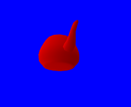

# 摄像机以及顶点处理阶段的总结

目前的代码中, 你可以通过修改 `matrix` 的内容来移动, 旋转, 缩放茶壶模型.

但是, 在真正的游戏程序中, 你要做的是完全不同的事情. 物体位于场景之中, 然后被摄像机所观察到. 你不能靠想像每个物体在屏幕上的样子来调整它们的属性. 你需要用更好的方法.

在真正的游戏引擎中, 计算顶点坐标(从 `position` 属性到 `gl_Position`)通常需要 3 步:

- 将模型的顶点相对于该模型中心的坐标(`position`)转换成相对于场景的坐标(一般是场景的原点 `(0, 0)`). 这一步将使用物体的位置(position), 旋转角度(rotation), 缩放尺寸值(scale).

- 将顶点相对于场景的坐标转化成相对于摄像机的位置和旋转角度, 使每个坐标都是从摄像机的角度进行观察的. 这一步使用名为 _view matrix(观察矩阵)_ 的矩阵(下面会介绍).

- 使用透视矩阵, 将顶点相对于摄像机的坐标转换成相对于屏幕的坐标.

_注意_: 在处理运动的模型时会稍微有些复杂.

因此, 你现在有了 3 个矩阵:

- _model(模型)_ 矩阵, 使用物体在场景中的位置, 旋转角度和缩放尺寸构建.
- _view(观察)_ 矩阵, 使用摄像机在场景中的位置和旋转角度构建.
- _perspective(透视)_ 矩阵, 使用视场(fov)和屏幕的宽高比构建.

在上传给着色器的之前, 前两个矩阵有时结合成一个 _modelview_ 矩阵. 不过简单起见, 我们还是分开来用.

## 观察矩阵

以下是观察矩阵的代码:

```rust
fn view_matrix(position: &[f32; 3], direction: &[f32; 3], up: &[f32; 3]) -> [[f32; 4]; 4] {
    let f = {
        let f = direction;
        let len = f[0] * f[0] + f[1] * f[1] + f[2] * f[2];
        let len = len.sqrt();
        [f[0] / len, f[1] / len, f[2] / len]
    };

    let s = [up[1] * f[2] - up[2] * f[1],
             up[2] * f[0] - up[0] * f[2],
             up[0] * f[1] - up[1] * f[0]];

    let s_norm = {
        let len = s[0] * s[0] + s[1] * s[1] + s[2] * s[2];
        let len = len.sqrt();
        [s[0] / len, s[1] / len, s[2] / len]
    };

    let u = [f[1] * s_norm[2] - f[2] * s_norm[1],
             f[2] * s_norm[0] - f[0] * s_norm[2],
             f[0] * s_norm[1] - f[1] * s_norm[0]];

    let p = [-position[0] * s_norm[0] - position[1] * s_norm[1] - position[2] * s_norm[2],
             -position[0] * u[0] - position[1] * u[1] - position[2] * u[2],
             -position[0] * f[0] - position[1] * f[1] - position[2] * f[2]];

    [
        [s_norm[0], u[0], f[0], 0.0],
        [s_norm[1], u[1], f[1], 0.0],
        [s_norm[2], u[2], f[2], 0.0],
        [p[0], p[1], p[2], 1.0],
    ]
}
```

这个函数有 3 个参数:

- 摄像机在场景中的位置 `position`.
- 在场景中, 摄像机指向的方向 `direction`.
- 上向量 `up`: 是在场景坐标系竖直向上方向的单位向量(一般是 `(0, 1, 0)`).

再一次修改顶点着色器的代码:

```glsl
#version 140

in vec3 position;
in vec3 normal;

out vec3 v_normal;

uniform mat4 perspective;
uniform mat4 view;
uniform mat4 model;

void main() {
    mat4 modelview = view * model;
    v_normal = transpose(inverse(mat3(modelview))) * normal;
    gl_Position = perspective * modelview * vec4(position, 1.0);
}
```

记住, 矩阵乘运算的顺序和其对应的转换被应用到顶点上的顺序是相反的. 第一个被应用到顶点上的变换(即模型矩阵), 其矩阵最靠近输入的顶点.

同样的, 传递新的 uniform 变量:

```rust
let view = view_matrix(&[2.0, -1.0, 1.0], &[-2.0, 1.0, 1.0], &[0.0, 1.0, 0.0]);

target.draw((&positions, &normals), &indices, &program,
            &uniform! { model: model, view: view, perspective: perspective, u_light: light },
            &params).unwrap();
```

本节我们使用固定的坐标作为例子. 创建一个第一人称的摄像机并不容易, 并且需要大量超出本指南内容范围的代码.

结果如下:



**[完整的代码在此](https://github.com/glium/glium/blob/master/examples/tutorial-12.rs).**

> 原地址: <https://github.com/glium/glium/blob/master/book/tuto-12-camera.md>
